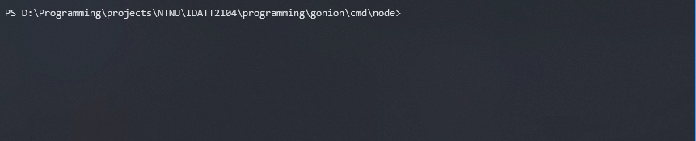

# Gonion - An onion routing service


An onion routing service, using a CLI, nodes and a directory server.

## Table of contents

1. [Introduction](#introduction)
1. [Implemented Functionality](#implemented-functionality)
1. [Future Work](#future-work)
1. [Dependencies](#dependencies)
1. [Installation](#installation)
1. [Usage](#usage)
1. [Testing](#testing)
1. [API Documentation](#api-documentation)

---

## Introduction

Gonion is an onion routing service that lets clients send HTTP requests through a network of
nodes. The most important factor is the privacy and security of the data that is sent.
The data is sent through secure and encrypted tunnels, and the data itself is encrypted
on top of that as well. The client can be sure that their privacy and their security is
maintained by using Gonion. (This is obviously a bit of an over-exaggeration, as having a
small amount of users and nodes basically makes it insecure.)

Gonion consists of 3 components. A client, nodes, and a directory. The client is what the
user will use to send requests to the Node network. The network consists of nodes. A Node
is a small server that either relays data, or fires a request on the behalf of a client.
The directory is a server that keeps data of all active nodes. The client needs to be able
to connect to the directory to be able to get access to Node data, otherwise the client
will be unable to send data anywhere.

The client program is a CLI that is very simple to use.

## Implemented functionality

* CLI Client for sending and receiving HTTP GET requests through the gonion-network
* Ability to pass a file which results can be saved to, or displaying it in the console
* Fully encrypted communication between nodes
* Encryption using RSA and shared-secret AES-256-CFB.
* Nodes that can transmit data between nodes and send data back to a client
* A Directory node API - Nodes can upload their data and clients can download it
* Works with both HTTP and HTTPS
* A custom Packet struct for easy communication through the network

## Future work

* Moving to a CLI framework to make more a better user experience
* Allowing more HTTP methods
* Capability to add files and headers to request data
* Moving services to TLS/HTTPS - I did not have time to do this within the timeframe, given
that there was too many other things to fix.
* Keeping better track of nodes in the Directory, making sure that if a node goes
offline, that it gets removed from the network
* As of right now, the service is only tested on a local network. Obviously this is not
what is really wanted, and so in the future it should be put on actual servers
* More test coverage, as this project turned out to be rather much work, a lot of time 
was simply spent on getting functionality to work, so there are definetly needs for more tests.

## Dependencies

Currently, Gonion has very few dependencies, and they are for convenience.

* [github.com/gin-gonic/gin](https://github.com/gin-gonic/gin)
  * HTTP framework used by the Directory Node, simply for convenience.
* [github.com/tidwall/secret](https://github.com/tidwall/secret)
  * Small AES-256-CFB library that makes it very simple to work with encryption. This is also just
    convenience.

Everything else is written using the built-in libraries that Go provides.

## Installation

As there are 3 components, there are 3 things you can install.

### Client

```bash
cd cmd/client
go build
```

### Node

```bash
cd cmd/node
go build
```

### Directory

```bash
cd cmd/directory
go build
```

All of these executables can then be renamed and/or moved folders contained in a PATH variable.
They can also simply be ran from their respective `cmd/*` folder. 

## Usage

As of right now, this is only tested and run on a local network, so that is what will be explained.
Future will be to make this work seamlessly over not just local internet.

For the client CLI to work, there MUST be a Directory running, and there MUST be at least 3
nodes running. Before a node can be ran, a Directory MUST be running, otherwise the node will
not have anything to connect to.

After a Directory and 3 Nodes have started, a client can repeatedly use the CLI to request
resources as many times as they want.

### Client

To run the CLI tool, the following command can be ran:

`./client [resource] <file>`

A resource is required, that is, some URL to some online resource. A file to save the response
can be specified, otherwise the response will be written to stdout.


### Directory

To run the Directory:

`./directory`

A Directory will then be served at port 9051.


### Node

To run a node, a port will need to be specified, and an IP can be specified, otherwise it will
use local IP.

`./node [-port port] < -ip ip >`

That is, if you run `./node -port 9052`, it will run a node at the local network at port 9052.
So far, this is the only thing that is properly tested, and it is recommended to only use it on
a local network for now.



## Testing

Testing everything can be done by running `go test ./...` in the root folder

## API Documentation

Only the directory has an API, and its use is very simple.

### Get nodes

Returns a list of all currently active nodes.

* URL
  * `/api/nodes`
* Method
  * `GET`
* URL Params
  * None
* Data Params
  * None
* Success response
  * 200 OK
    * `[{"ip": "127.0.0.1", "port":"1234", "public_key":"123abc..."}, ...]`

### Post Node

Adds a node to the directory.

* URL
  * `/api/nodes`
* Method
  * `POST`
* URL Params
  * None
* Data Params
  * Node info
    * `{"ip": "127.0.0.1", "port":"1234", "public_key":"123abc..."}`
* Success response
  * 200 OK
    * `{"ip": "127.0.0.1", "port":"1234", "public_key":"123abc..."}`
* Error response
  * 400 Bad Request

### Health check

A simple health check that simply returns `{"status": "ok"}` if the server is running.

* URL
  * `/api/nodes`
* Method
  * `GET`
* Success response
  * 200 OK
    * `{"status":"ok"}`
